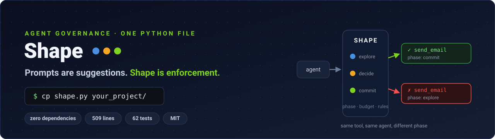
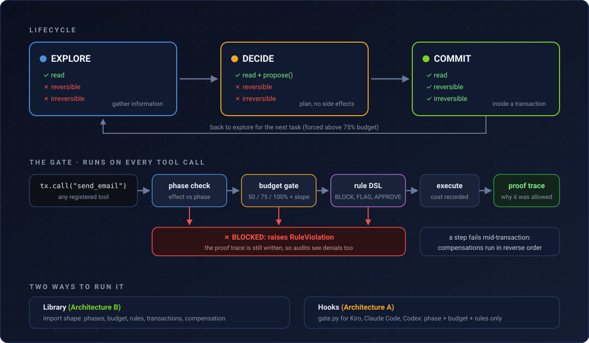

<h1 align="center">
  <a href="https://github.com/vidanov/shape"></a>
</h1>

<div align="center">

[](test_shape.py)
[](shape.py)
[](shape.py)
[](LICENSE)
[](#contributing)

**Hard limits for AI agents: phases, transactions, budget gates and proof traces. One file you copy into your project.**

[Quick start](#quick-start) · [How it works](#how-it-works) · [Rules](#rules-humans-can-read) · [Integrations](#govern-a-coding-agent) · [Comparison](#how-shape-compares) · [Docs](#core-concepts)

</div>

<p align="center">
  
</p>

<p align="center">
  🌐 <a href="https://vidanov.github.io/shape/">Visual explainer</a> · 🎮 <a href="https://vidanov.github.io/shape/demo.html">Interactive demo</a> · 📄 <a href="https://vidanov.github.io/shape/article.html">Full article</a>
</p>

## Why this exists

```
Your agent just mass-emailed 10,000 customers with a hallucinated discount.
It had the tool. It had the permission. Nobody told it to stop.
```

Agent frameworks hand out tools and optimize for capability. Permission is left to the system prompt, and a system prompt is a suggestion: it can be ignored, overridden, or hallucinated around. When the model holds `DELETE FROM users` as a callable function, "please be careful" is not a control.

| Gap in your framework | What goes wrong |
|-----------------------|-----------------|
| No lifecycle | The agent writes before it finishes reading |
| No transactions | Step 2 of 3 fails, step 1 sticks, your data is inconsistent |
| No budget control | You learn about the 400-call loop from the invoice |
| No audit trail | Logs say what happened, never why it was allowed |

Shape closes all four from outside the agent. What you get:

- 🚦 **Phases**: EXPLORE and DECIDE are read only. A write tool in the wrong phase raises `PhaseError` instead of logging a warning.
- ⛓️ **Transactions**: `commit()` buffers compensations. When step 3 fails, steps 1 and 2 roll back in reverse order.
- 💸 **Budget gates**: 50% spent sends a degrade signal, 75% blocks commits and forces re-evaluation, 100% stops everything.
- 📈 **Spike detection**: an optional cost-per-second threshold pauses the agent that discovers infinite loops before your invoice does.
- 📜 **Rule DSL**: `BLOCK send_email WHEN phase IS NOT commit` reads like the policy it implements. No Cedar, no Rego, no policy server.
- 🙋 **Approval hooks**: `REQUIRE APPROVAL FOR * WHEN tool IS irreversible` routes the call to a human callback before it runs.
- 🧾 **Proof traces**: every call records the phase check, budget state and rule matches that allowed it. Denials get traces too.
- 🪶 **Zero dependencies**: 509 lines of stdlib Python in one file. Auditable in one sitting.

The longer argument, with the industry context, is in [CONCEPT.md](CONCEPT.md).

## Quick start

> Requires Python 3 and nothing else: `shape.py` imports only `re`, `time`, `dataclasses`, `datetime`, `enum` and `typing`.

```bash
curl -LO https://raw.githubusercontent.com/vidanov/shape/main/shape.py
# or clone and: cp shape.py your_project/
```

No package manager involved. Vendoring one file is the entire supply chain.

```python
from shape import Agent, ToolEffect

agent = Agent("support-bot", budget=5.00)

agent.tool("lookup_customer", effect=ToolEffect.READ,         fn=lookup_fn)
agent.tool("update_record",   effect=ToolEffect.REVERSIBLE,   fn=update_fn, compensation=undo_fn)
agent.tool("send_email",      effect=ToolEffect.IRREVERSIBLE, fn=email_fn)

agent.rules("""
    BLOCK send_email WHEN phase IS NOT commit
    BLOCK * WHEN budget ABOVE 90%
""")

# EXPLORE: read tools only. Calling send_email here raises PhaseError.
with agent.explore() as ctx:
    customer = ctx.call("lookup_customer", id="C-1234")

# COMMIT: writes unlock, wrapped in a transaction.
with agent.commit() as tx:
    tx.call("update_record", cost=0.01, id="C-1234", status="welcomed")
    tx.call("send_email",    cost=0.10, to=customer["email"], template="welcome")
    # if send_email raises, update_record is compensated automatically
```

Run the shipped demos to see the traces for yourself:

```bash
python3 examples/customer_service.py   # refund flow: 5 governed calls, 1 transaction
python3 examples/manufacturing.py      # PLC writes behind approval gates
python3 -m pytest test_shape.py -q     # 62 tests
```

## How it works

<p align="center">
  
</p>

- Every `ctx.call()` and `tx.call()` passes the same gate, in order: phase check, budget gate, rule DSL. The outcome lands in a proof trace whether the call ran or was blocked.
- `commit()` opens a transaction. Calls with side effects buffer their compensation functions, and an exception inside the block aborts and runs them in reverse order. Compensation is best effort: a failing compensation is logged, not raised.
- Cost is recorded after a call executes, like a credit card: the purchase that maxes you out goes through, the next one declines. Fixed costs come from `cost=` on the call, real costs from a `cost_fn` that reads the tool's response.
- Blocked is loud. A denied call raises `RuleViolation` (or `ApprovalRequired`), so the calling code cannot quietly continue down a path governance already refused.

Concept-by-concept docs: [phases](docs/phases.md) · [effects](docs/effects.md) · [transactions](docs/transactions.md) · [budget](docs/budget.md) · [rules](docs/rules.md) · [traces](docs/traces.md) · [architecture](docs/architecture.md)

## Rules humans can read

Rules are plain lines of text, so the person who owns the policy can review the policy. This is what ships in the Kiro integration:

```
BLOCK fs_write WHEN phase IS NOT commit
BLOCK * WHEN budget ABOVE 90%
REQUIRE APPROVAL FOR * WHEN tool IS irreversible
FLAG * WHEN time OUTSIDE 06:00-22:00
```

Four actions (`BLOCK`, `ALLOW`, `FLAG`, `REQUIRE APPROVAL FOR`), conditions on `phase`, `tool` effect, `budget` and `time`, combined with `WHEN`, `AND` and `UNLESS`. The whole parser is about 50 lines of `shape.py`; the grammar and operator table are in [docs/rules.md](docs/rules.md).

## Govern a coding agent

Shape also runs outside your code, as pre-tool-use hooks for CLI agents. The hook evaluates phase, budget and rules before the CLI executes anything:

| Agent | Folder | Wire-up |
|-------|--------|---------|
| [Kiro CLI](https://kiro.dev) | [`kiro/`](kiro/README.md) | agent config + PreToolUse/PostToolUse hooks |
| [Claude Code](https://docs.anthropic.com/en/docs/claude-code) | [`claude/`](claude/README.md) | `.claude/settings.json` hooks |
| [OpenAI Codex CLI](https://github.com/openai/codex) | [`codex/`](codex/README.md) | config-based hooks |

Each folder is the setup I landed on after wiring Shape into that CLI: a `gate.py`, a `trace.py`, a sample rules file, and the settings snippet that registers them. Sessions start in EXPLORE (read only); you unlock writes explicitly with `shape-transition commit`.

<details>
<summary><b>What hooks can and cannot enforce (Architecture A)</b></summary>

Hook mode gives you phase enforcement, budget gates, rules and traces, but the CLI still executes tools itself. That means:

- no transactional atomicity, each tool call stands alone
- no compensation or rollback on failure
- budget is estimated per call, not billed cost
- phase transitions are manual (`shape-transition explore|decide|commit`)

For the full model including transactions, import Shape as a library and let it orchestrate the agent (Architecture B). The trade-offs are laid out in [docs/architecture.md](docs/architecture.md).

</details>

## Govern a framework agent

If your framework calls Python functions, Shape can stand in front of them:

```python
from shape import Agent, ToolEffect, wrap_tool

agent = Agent("my-agent", budget=5.00)
governed_search = wrap_tool(agent, "search", search_fn, ToolEffect.READ)
governed_email  = wrap_tool(agent, "send_email", email_fn, ToolEffect.IRREVERSIBLE)
```

Works with Strands, LangGraph, CrewAI or raw Python. Recipes per framework: [docs/framework-integration.md](docs/framework-integration.md).

**Metering real LLM cost.** The model itself burns tokens outside your tool costs, so [`bedrock.py`](bedrock.py) turns each Bedrock Converse response into an exact charge (pricing table for Claude 4, Nova, Mistral Large 3 and DeepSeek v3.2, April 2026):

```python
from bedrock import bedrock_cost, converse

agent.tool("call_llm", effect=ToolEffect.READ,
           fn=lambda **kw: converse(client, MODEL_ID, kw["messages"]),
           cost_fn=bedrock_cost)   # budget gates now fire on real dollars
```

There is also a guide for pairing Shape with AgentCore's agent wallets: [docs/agentcore-payments.md](docs/agentcore-payments.md).

## Examples

| Demo | What it shows |
|------|---------------|
| [`examples/customer_service.py`](examples/customer_service.py) | Refund flow: explore reads order and policy, commit refunds, updates and emails in one transaction, $0.61 of a $2.00 budget |
| [`examples/manufacturing.py`](examples/manufacturing.py) | PLC speed change: irreversible writes behind an approval callback, after-hours calls flagged by a `time OUTSIDE 06:00-22:00` rule |

Both print the same proof traces you saw in the animation above. Run them before wiring Shape into anything real.

## How Shape compares

| Capability | Galileo | AWS AgentCore | Atomix | **Shape** |
|-----------|---------|---------------|--------|-----------|
| Phase enforcement | ✗ | ✗ | ✗ | ✓ |
| Transactional tool calls | ✗ | ✗ | ✓ (paper) | ✓ |
| Compensation / rollback | ✗ | ✗ | partial | ✓ |
| Cost as control signal | ✗ | ✗ | ✗ | ✓ |
| Proof traces | ✗ | ✗ | ✗ | ✓ |
| Readable rule DSL | ✗ | Cedar | ✗ | ✓ |
| Dependencies | many | AWS SDK | n/a | **zero** |

And the honest half of the table, where Shape is the wrong choice:

| You need | Use instead |
|----------|-------------|
| Org-wide policy across many services and teams | AgentCore with Cedar |
| Dashboards, evals, drift detection | Galileo Agent Control |
| Distributed transactions across services | A workflow engine; Shape compensations are in-process and best effort |
| A non-Python agent library | Shape's library is Python only (the CLI hooks work with any agent that supports them) |

Rule of thumb: Shape fits when one process runs one agent and you want its blast radius capped this afternoon, not after a platform rollout.

## Core concepts

| Concept | One-liner | Docs |
|---------|-----------|------|
| Phases | EXPLORE, DECIDE, COMMIT: controls when the agent may act | [docs/phases.md](docs/phases.md) |
| Effect classification | READ / REVERSIBLE / IRREVERSIBLE, declared per tool | [docs/effects.md](docs/effects.md) |
| Transactions | All-or-nothing commits with automatic compensation | [docs/transactions.md](docs/transactions.md) |
| Budget gates | Cost as a control signal, thresholds at 50/75/100% | [docs/budget.md](docs/budget.md) |
| Rule DSL | Governance rules readable by non-engineers | [docs/rules.md](docs/rules.md) |
| Proof traces | A structured record of why each call was allowed | [docs/traces.md](docs/traces.md) |
| Architectures | Hook mode vs orchestrator mode, and when each fits | [docs/architecture.md](docs/architecture.md) |

## Project structure

```
shape.py                  the whole library: 509 lines, stdlib only
bedrock.py                real cost tracking for Bedrock Converse responses
test_shape.py             62 tests covering phases, budget, rules, transactions
examples/                 runnable demos (customer service, manufacturing)
kiro/  claude/  codex/    hook packages for CLI coding agents
docs/                     concept docs plus the images on this page
site/                     the explainer site (GitHub Pages)
```

## Contributing

Useful PRs, roughly in order of impact:

- A hook package for another CLI agent. Copy the `kiro/` pattern: `gate.py`, `trace.py`, a rules file, a config snippet.
- More models in the `bedrock.py` pricing table, or a `cost_fn` for another provider.
- New DSL conditions (day of week, per-tool call counts) with tests in `test_shape.py`.

Run `python3 -m pytest test_shape.py -q` before opening the PR; all 62 should stay green.

## License

MIT, see [LICENSE](LICENSE).

<div align="center">
  <sub>Built by <a href="https://github.com/vidanov">Alexei Vidanov</a> · <a href="https://vidanov.github.io/shape/">explainer</a> · <a href="https://vidanov.github.io/shape/demo.html">live demo</a></sub>
</div>
